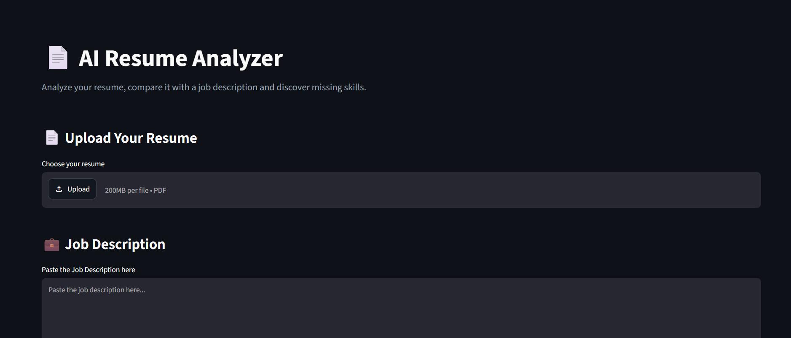
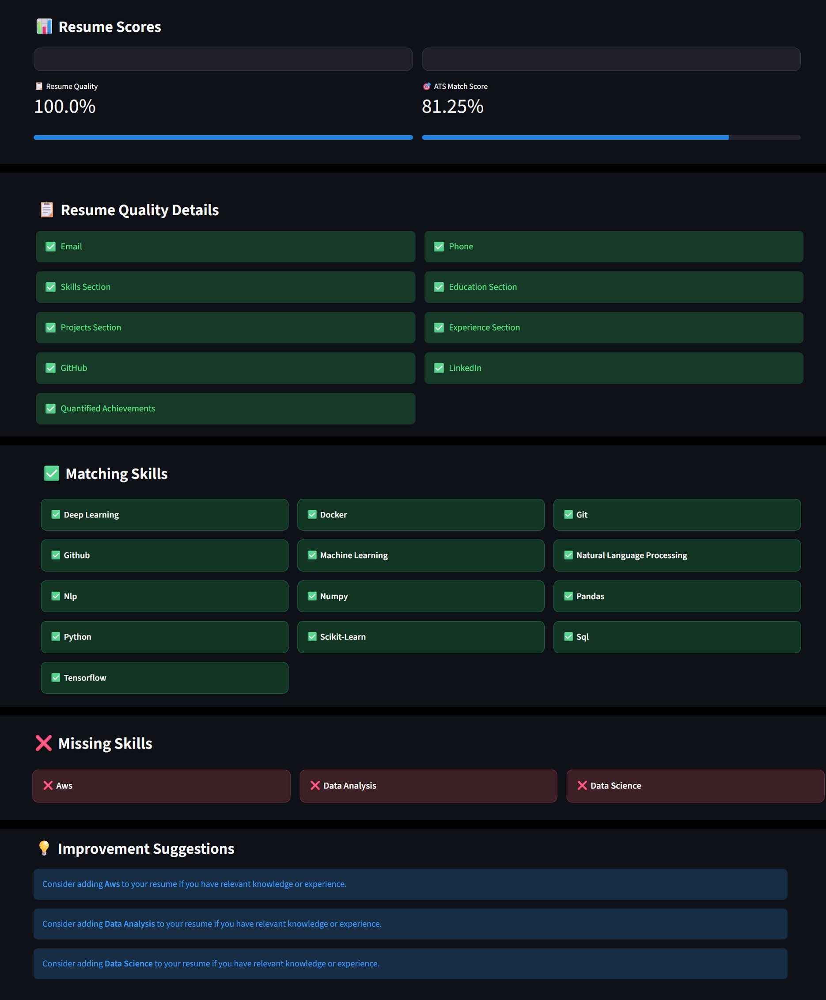

# 🤖 AI Resume Analyzer

An AI-powered resume analyzer that evaluates resume quality, compares resumes with job descriptions, identifies matching and missing skills, and provides improvement suggestions.

## 🚀 Live Demo

https://ai-resume-analyzer-pfcyhmylf3kulzm6tgwtwr.streamlit.app/

## ✨ Features

- 📄 Upload resume in PDF format
- 📊 Resume quality score
- 🎯 ATS match score
- ✅ Matching skills detection
- ❌ Missing skills detection
- 💡 Resume improvement suggestions
- 📝 Extract resume text
- 🔍 Compare resume with job description

## 🛠️ Tech Stack

- Python
- Streamlit
- PyMuPDF
- Pandas
- NumPy
- Scikit-learn
- NLP
- Git & GitHub

## 📂 Project Structure

```text
AI-Resume-Analyzer/
│
├── app.py
├── requirements.txt
├── .gitignore
│
└── utils/
    ├── matcher.py
    ├── pdf_parser.py
    └── resume_analyzer.py
    ```
    ## 📸 Screenshots

### 🏠 Home Page



### 📊 Resume Analysis Results
